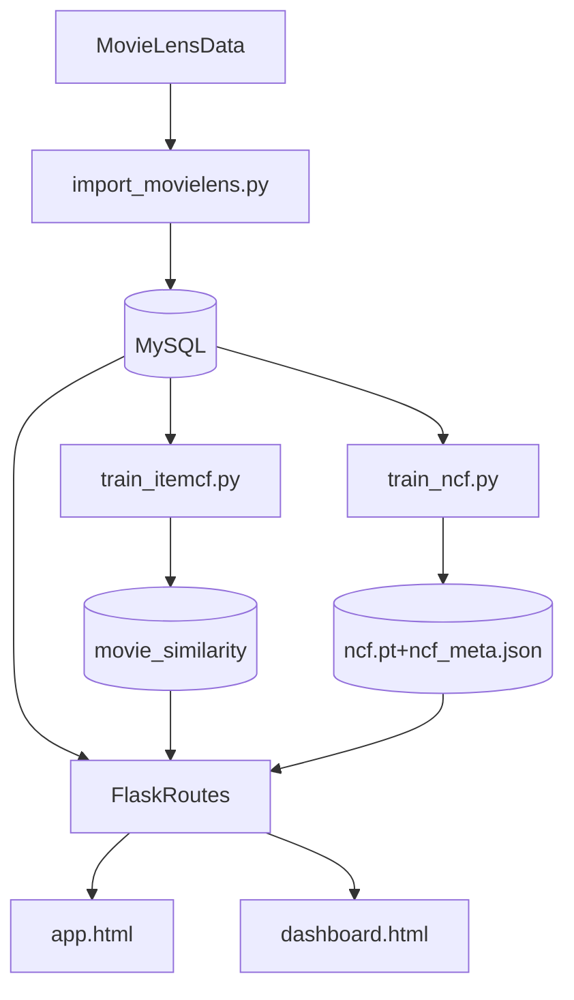

# 毕业设计说明（论文材料框架）

本文档用于把现有代码实现映射为本科毕业设计所需的“论文式材料”。

## 1. 课题背景与目标

### 1.1 背景
- 信息过载场景下，用户难以快速发现感兴趣电影。
- 推荐系统可显著降低检索成本，提高内容发现效率。

### 1.2 设计目标
- 完成可运行的电影推荐系统（用户、评分、推荐、看板）。
- 以 ItemCF 为主模型，实现可解释推荐。
- 增加 NCF/Hybrid 作为扩展探索。
- 用离线评估验证效果。

## 2. 需求分析

### 2.1 功能需求
- 用户注册、登录、退出
- 电影检索、详情浏览、评分
- 个性化推荐（ItemCF/NCF/Hybrid）
- 冷启动热门推荐
- 推荐反馈（like/dislike）
- 数据看板（评分分布、类型、年份趋势、离线指标）

### 2.2 非功能需求
- 可维护性：脚本化训练与评估流程
- 可扩展性：支持替换或新增推荐模型
- 可解释性：给出推荐来源解释
- 可复现性：离线评估参数可配置

## 3. 系统架构设计

### 3.1 模块划分
- Web/API：`backend/app/routes.py`
- 数据模型：`backend/app/models.py`
- 数据导入：`backend/scripts/import_movielens.py`
- 模型训练：`backend/scripts/train_itemcf.py`、`backend/scripts/train_ncf.py`
- 模型评估：`backend/scripts/evaluate_itemcf.py`、`backend/scripts/evaluate_models.py`

## 4. 数据库设计

核心表：
- `users`：用户信息
- `movies`：电影基础信息
- `ratings`：用户评分行为
- `movie_similarity`：离线 ItemCF 相似度
- `recommendation_feedback`：推荐反馈

索引与约束（示例）：
- `ratings(user_id, movie_id)` 及唯一约束
- `movie_similarity(movie_id, similar_movie_id)` 唯一约束

## 5. 算法设计

### 5.1 ItemCF（主模型）
- 从评分表构建电影-用户稀疏矩阵。
- 用余弦相似度计算每部电影邻居。
- 在线阶段按“相似度 × 用户历史评分”累加候选分数并排序。

### 5.2 NCF（扩展模型）
- 用户/电影 ID 映射为 embedding。
- 拼接后输入 MLP 得到偏好得分。
- 训练目标为二分类（正例交互 + 负采样）。

### 5.3 Hybrid（扩展模型）
- ItemCF 负责召回候选。
- NCF 对候选进行重排。

## 6. 实验设计与结果分析

### 6.1 评估协议
- leave-last-out（每个用户最后一个正反馈做测试）
- 指标：Precision@K, Recall@K, MAP@K, NDCG@K, MRR@K, Coverage

### 6.2 结果读取
- `backend/artifacts/offline_metrics.json`
- `backend/artifacts/evaluation_results.json`

### 6.3 建议结论表述
- ItemCF 在当前数据与参数下更稳健。
- NCF/Hybrid 是有效扩展尝试，但不一定超越基线。
- 消融实验说明参数对效果有显著影响。

## 7. 测试与验证

### 7.1 功能测试
- 用户认证流程
- 评分写入与更新
- 推荐接口返回与解释信息
- 看板图表接口正常返回

### 7.2 性能与稳定性
- 训练脚本可完成并产出 artifacts
- 推荐接口响应时间可接受
- 冷启动场景有兜底返回

## 8. 不足与改进方向

- 目前主要依赖离线指标，缺少在线 A/B。
- 冷启动处理仍以热门兜底为主，可补充内容特征。
- 可进一步引入更严格时间切分与更公平候选集评估协议。

## 9. 答辩口径建议（统一版）

- 数据库实现统一为 MySQL。
- 主模型是 ItemCF，NCF/Hybrid 是扩展实验。
- 强调“系统工程闭环 + 可解释推荐 + 评估与可视化”。
