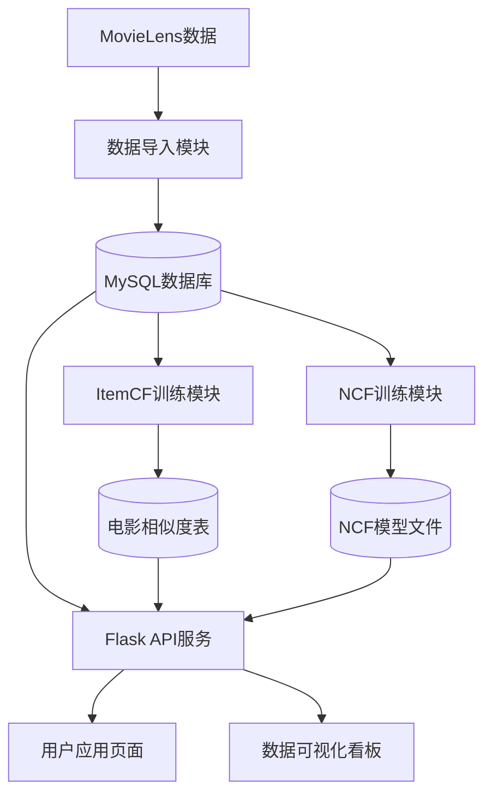
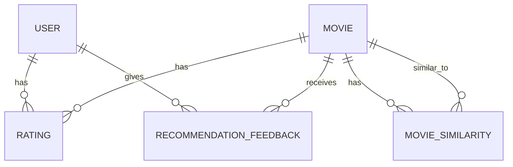

# 基于协同过滤与深度学习的电影推荐系统设计与实现

## 摘要

随着互联网和流媒体平台的快速发展，电影内容呈现爆炸式增长，用户面临着信息过载的问题。如何为用户推荐个性化的电影内容，提高用户体验，成为了当前推荐系统研究的重要课题。本项目设计并实现了一个基于协同过滤和深度学习的电影推荐系统，旨在为用户提供精准、可解释的电影推荐服务。

系统采用Flask作为后端框架，MySQL作为数据库，实现了用户管理、电影检索、评分管理、个性化推荐等核心功能。推荐算法方面，以基于物品的协同过滤（ItemCF）为主要算法，确保推荐结果的可解释性；同时集成了神经协同过滤（NCF）和混合推荐（Hybrid）算法作为扩展，提升推荐性能。系统还提供了数据可视化看板，展示评分分布、电影类型分布、年份趋势等统计信息，以及离线评估指标。

实验结果表明，ItemCF算法在当前数据集上表现稳健，NCF和Hybrid算法作为扩展尝试，为系统提供了更多的推荐策略选择。系统整体架构清晰，功能完整，满足了毕业设计的要求，为电影推荐系统的研究和应用提供了参考。

## 1. 引言

### 1.1 研究背景

在信息时代，随着互联网技术的快速发展和数字内容的爆炸式增长，用户面临着严重的信息过载问题。特别是在电影领域，每年都有大量的新电影上映，同时还有海量的经典电影库存，用户很难从如此庞大的电影库中找到自己感兴趣的内容。传统的搜索方式已经无法满足用户的个性化需求，推荐系统应运而生。

推荐系统通过分析用户的历史行为和偏好，为用户推荐可能感兴趣的内容，从而降低用户的信息检索成本，提高内容发现效率。在电影领域，推荐系统已经成为各大流媒体平台（如Netflix、爱奇艺、腾讯视频等）的核心功能之一，对提升用户体验和平台粘性起到了重要作用。

### 1.2 研究目标

本项目的主要研究目标是设计并实现一个功能完整、性能良好的电影推荐系统，具体包括：

1. 实现用户注册、登录、电影检索、评分等基本功能
2. 基于协同过滤和深度学习技术，实现个性化电影推荐
3. 提供推荐结果的可解释性，增强用户对推荐系统的信任
4. 构建数据可视化看板，展示系统运行状态和推荐效果
5. 通过离线评估，验证不同推荐算法的性能

### 1.3 研究意义

本项目的研究意义主要体现在以下几个方面：

1. **理论意义**：通过对比不同推荐算法（ItemCF、NCF、Hybrid）的性能，深入理解各种推荐算法的优缺点，为推荐系统的研究提供参考。
2. **实践意义**：实现了一个功能完整的电影推荐系统，可直接应用于实际场景，为用户提供个性化的电影推荐服务。
3. **教育意义**：作为毕业设计项目，本系统涵盖了Web开发、数据库设计、机器学习等多个领域的知识，有助于学生综合运用所学知识，提高实践能力。

### 1.4 论文结构

本论文的结构安排如下：

- **第1章 引言**：介绍研究背景、目标和意义。
- **第2章 系统需求分析**：分析系统的功能需求和非功能需求。
- **第3章 系统架构设计**：设计系统的整体架构和模块划分。
- **第4章 数据库设计**：设计系统的数据库表结构。
- **第5章 算法设计与实现**：详细介绍推荐算法的设计与实现。
- **第6章 实验结果与分析**：展示并分析系统的实验结果。
- **第7章 系统实现与测试**：介绍系统的实现细节和测试结果。
- **第8章 总结与展望**：总结系统的主要成果，分析存在的不足，并提出未来的改进方向。

## 2. 系统需求分析

### 2.1 功能需求

基于对电影推荐系统的理解和项目的实际实现，系统的功能需求主要包括以下几个方面：

#### 2.1.1 用户管理
- **用户注册**：允许新用户创建账号，设置用户名和密码。
- **用户登录**：允许已注册用户通过用户名和密码登录系统。
- **用户退出**：允许登录用户安全退出系统。
- **个人信息查看**：用户可以查看自己的个人信息和评分历史。

#### 2.1.2 电影管理
- **电影检索**：用户可以通过关键词搜索电影。
- **电影详情**：用户可以查看电影的详细信息，包括标题、年份、类型、平均评分和评分人数。
- **电影评分**：用户可以对电影进行评分（0.5-5.0分），并可以更新已有的评分。
- **热门电影**：系统可以展示评分较高、评价人数较多的热门电影。

#### 2.1.3 推荐功能
- **个性化推荐**：根据用户的历史评分，为用户推荐个性化的电影。
- **推荐算法选择**：支持多种推荐算法，包括ItemCF、NCF和Hybrid。
- **推荐解释**：为推荐结果提供解释，说明推荐的原因。
- **推荐反馈**：用户可以对推荐结果进行反馈（喜欢/不喜欢）。
- **冷启动处理**：对于新用户，系统提供热门电影作为推荐。

#### 2.1.4 数据可视化
- **评分分布**：展示系统中电影评分的分布情况。
- **电影类型分布**：展示不同类型电影的数量和受欢迎程度。
- **年份趋势**：展示不同年份电影的数量和平均评分。
- **用户活跃度**：展示用户的评分活跃度。
- **电影评分统计**：展示电影评分数量的分布情况。
- **离线评估指标**：展示不同推荐算法的离线评估指标。

### 2.2 非功能需求

#### 2.2.1 可维护性
- **模块化设计**：系统采用模块化设计，各模块之间职责明确，便于维护和扩展。
- **脚本化流程**：数据导入、模型训练、评估等流程均通过脚本实现，便于自动化执行。
- **代码规范**：代码遵循Python代码规范，注释完整，便于理解和维护。

#### 2.2.2 可扩展性
- **算法扩展性**：系统设计支持替换或新增推荐算法，只需实现相应的接口即可。
- **数据扩展性**：系统支持导入不同规模的MovieLens数据集，适应不同的数据规模。
- **功能扩展性**：系统架构设计预留了扩展空间，便于添加新功能。

#### 2.2.3 可解释性
- **推荐解释**：ItemCF算法提供了基于相似度的推荐解释，用户可以了解推荐的原因。
- **算法透明度**：系统对推荐算法的实现和原理进行了详细说明，提高了算法的透明度。

#### 2.2.4 可复现性
- **离线评估**：系统提供了完整的离线评估流程，评估参数可配置，结果可复现。
- **环境配置**：系统提供了requirements.txt和environment.yml文件，便于复现开发环境。

#### 2.2.5 性能要求
- **响应时间**：推荐接口的响应时间应在可接受范围内，确保用户体验。
- **训练效率**：模型训练过程应高效，能够在合理的时间内完成。
- **存储效率**：系统应合理存储数据和模型，避免存储空间的浪费。

### 2.3 数据需求

系统需要处理的数据主要包括：

- **用户数据**：用户ID、用户名、密码哈希等。
- **电影数据**：电影ID、标题、年份、类型等。
- **评分数据**：用户ID、电影ID、评分值、评分时间等。
- **相似度数据**：电影ID、相似电影ID、相似度分数等。
- **推荐反馈数据**：用户ID、电影ID、反馈类型（喜欢/不喜欢）、反馈时间等。

系统使用MovieLens数据集作为数据源，该数据集包含了用户对电影的评分信息，是推荐系统研究中常用的基准数据集。

## 3. 系统架构设计

### 3.1 整体架构

系统采用分层架构设计，包括数据层、服务层和表示层三个主要层次。数据层负责数据的存储和管理，服务层负责业务逻辑的处理，表示层负责用户界面的展示。系统的整体架构如图3-1所示。



图3-1 系统整体架构图

### 3.2 模块划分

系统按照功能和职责划分为以下几个核心模块：

#### 3.2.1 数据导入模块
- **功能**：负责将MovieLens数据集导入到MySQL数据库中。
- **实现文件**：`backend/scripts/import_movielens.py`
- **流程**：读取MovieLens数据文件，解析数据，创建数据库表，并将数据插入到相应的表中。

#### 3.2.2 模型训练模块
- **ItemCF训练**：负责训练基于物品的协同过滤模型，计算电影之间的相似度。
  - 实现文件：`backend/scripts/train_itemcf.py`
  - 流程：从数据库中读取评分数据，构建电影-用户评分矩阵，计算电影之间的余弦相似度，将相似度结果存储到数据库中。

- **NCF训练**：负责训练神经协同过滤模型。
  - 实现文件：`backend/scripts/train_ncf.py`
  - 流程：从数据库中读取评分数据，构建训练数据集，训练NCF模型，将模型和相关元数据保存到文件系统中。

#### 3.2.3 模型评估模块
- **ItemCF评估**：负责评估ItemCF算法的性能。
  - 实现文件：`backend/scripts/evaluate_itemcf.py`
  - 流程：从数据库中读取评分数据，划分训练集和测试集，使用ItemCF算法进行推荐，计算评估指标。

- **多模型评估**：负责评估多种推荐算法的性能，并进行消融实验。
  - 实现文件：`backend/scripts/evaluate_models.py`
  - 流程：从数据库中读取评分数据，划分训练集和测试集，使用不同的推荐算法进行推荐，计算评估指标，比较不同算法的性能。

#### 3.2.4 Web API服务模块
- **功能**：提供RESTful API接口，处理用户请求，返回相应的结果。
- **实现文件**：`backend/app/routes.py`
- **主要接口**：
  - 用户认证接口：注册、登录、退出
  - 电影接口：电影列表、电影详情、热门电影
  - 评分接口：提交评分、查看评分历史
  - 推荐接口：个性化推荐、推荐解释
  - 统计接口：评分分布、类型分布、年份趋势等

#### 3.2.5 数据可视化模块
- **功能**：展示系统的统计数据和评估结果。
- **实现文件**：`backend/app/templates/dashboard.html`
- **技术栈**：Bootstrap + ECharts
- **主要图表**：评分分布柱状图、类型分布饼图、年份趋势折线图、用户活跃度柱状图等。

### 3.3 数据流设计

系统的数据流设计如下：

1. **数据导入流程**：
   - 从MovieLens数据集读取电影和评分数据
   - 将数据插入到MySQL数据库的movies和ratings表中

2. **模型训练流程**：
   - 从数据库中读取评分数据
   - 训练ItemCF模型，计算电影相似度，存储到movie_similarity表中
   - 训练NCF模型，保存模型文件到artifacts目录

3. **推荐流程**：
   - 用户登录系统
   - 用户请求推荐
   - 系统根据用户选择的推荐算法（ItemCF、NCF或Hybrid）生成推荐结果
   - 系统返回推荐结果和推荐解释

4. **评分流程**：
   - 用户对电影进行评分
   - 系统将评分存储到ratings表中
   - 系统更新用户的评分历史

5. **反馈流程**：
   - 用户对推荐结果进行反馈（喜欢/不喜欢）
   - 系统将反馈存储到recommendation_feedback表中

6. **数据可视化流程**：
   - 用户访问dashboard页面
   - 系统从数据库中查询统计数据
   - 系统将数据转换为图表展示

### 3.4 技术栈选择

系统采用以下技术栈：

- **后端**：Python 3.10、Flask、Flask-Login、Flask-SQLAlchemy
- **数据库**：MySQL、PyMySQL
- **机器学习**：NumPy、Pandas、SciPy、scikit-learn、PyTorch
- **前端**：HTML、CSS、JavaScript、Bootstrap、ECharts
- **开发工具**：VS Code、Git

技术栈选择的理由：

- **Flask**：轻量级Web框架，易于学习和使用，适合构建RESTful API。
- **MySQL**：成熟稳定的关系型数据库，适合存储结构化数据。
- **PyTorch**：强大的深度学习框架，适合实现NCF模型。
- **Bootstrap**：响应式前端框架，易于构建美观的用户界面。
- **ECharts**：功能强大的可视化库，适合展示各种统计数据。

## 4. 数据库设计

### 4.1 数据库表结构

系统使用MySQL数据库，设计了以下核心表：

#### 4.1.1 users表

| 字段名 | 数据类型 | 约束 | 描述 |
| :--- | :--- | :--- | :--- |
| `id` | `INT` | `PRIMARY KEY, AUTO_INCREMENT` | 用户ID |
| `username` | `VARCHAR(64)` | `UNIQUE, NOT NULL, INDEX` | 用户名 |
| `password_hash` | `VARCHAR(256)` | `NOT NULL` | 密码哈希值 |
| `created_at` | `DATETIME` | `NOT NULL, DEFAULT CURRENT_TIMESTAMP` | 创建时间 |

#### 4.1.2 movies表

| 字段名 | 数据类型 | 约束 | 描述 |
| :--- | :--- | :--- | :--- |
| `id` | `INT` | `PRIMARY KEY, AUTO_INCREMENT` | 电影ID |
| `title` | `VARCHAR(255)` | `NOT NULL, INDEX` | 电影标题 |
| `year` | `INT` | `NULL, INDEX` | 电影年份 |
| `genres` | `VARCHAR(255)` | `NULL` | 电影类型，多个类型用竖线分隔 |

#### 4.1.3 ratings表

| 字段名 | 数据类型 | 约束 | 描述 |
| :--- | :--- | :--- | :--- |
| `id` | `INT` | `PRIMARY KEY, AUTO_INCREMENT` | 评分ID |
| `user_id` | `INT` | `NOT NULL, INDEX, FOREIGN KEY` | 用户ID，关联users表 |
| `movie_id` | `INT` | `NOT NULL, INDEX, FOREIGN KEY` | 电影ID，关联movies表 |
| `rating` | `FLOAT` | `NOT NULL` | 评分值（0.5-5.0） |
| `timestamp` | `DATETIME` | `NULL` | 评分时间 |
| `UNIQUE KEY` | - | `(user_id, movie_id)` | 确保用户对同一电影只有一条评分记录 |

#### 4.1.4 movie_similarity表

| 字段名 | 数据类型 | 约束 | 描述 |
| :--- | :--- | :--- | :--- |
| `id` | `INT` | `PRIMARY KEY, AUTO_INCREMENT` | 相似度记录ID |
| `movie_id` | `INT` | `NOT NULL, INDEX, FOREIGN KEY` | 电影ID，关联movies表 |
| `similar_movie_id` | `INT` | `NOT NULL, INDEX, FOREIGN KEY` | 相似电影ID，关联movies表 |
| `score` | `FLOAT` | `NOT NULL` | 相似度分数 |
| `UNIQUE KEY` | - | `(movie_id, similar_movie_id)` | 确保每对电影只有一条相似度记录 |

#### 4.1.5 recommendation_feedback表

| 字段名 | 数据类型 | 约束 | 描述 |
| :--- | :--- | :--- | :--- |
| `id` | `INT` | `PRIMARY KEY, AUTO_INCREMENT` | 反馈ID |
| `user_id` | `INT` | `NOT NULL, INDEX, FOREIGN KEY` | 用户ID，关联users表 |
| `movie_id` | `INT` | `NOT NULL, INDEX, FOREIGN KEY` | 电影ID，关联movies表 |
| `feedback` | `VARCHAR(16)` | `NOT NULL` | 反馈类型（like/dislike） |
| `context` | `VARCHAR(64)` | `NOT NULL, DEFAULT ''` | 反馈上下文 |
| `created_at` | `DATETIME` | `NOT NULL, DEFAULT CURRENT_TIMESTAMP, INDEX` | 创建时间 |
| `UNIQUE KEY` | - | `(user_id, movie_id, context)` | 确保用户在同一上下文中对同一电影只有一条反馈记录 |

### 4.2 数据库关系设计

数据库表之间的关系如图4-1所示：



图4-1 数据库表关系图

### 4.3 索引设计

为了提高查询性能，系统在以下字段上创建了索引：

- **users表**：`username`字段创建了唯一索引，加速用户登录和注册时的查询。
- **movies表**：`title`字段创建了普通索引，加速电影搜索；`year`字段创建了普通索引，加速按年份查询。
- **ratings表**：`user_id`和`movie_id`字段分别创建了普通索引，加速按用户和电影查询评分；同时创建了`(user_id, movie_id)`的唯一索引，确保数据完整性。
- **movie_similarity表**：`movie_id`和`similar_movie_id`字段分别创建了普通索引，加速相似电影的查询；同时创建了`(movie_id, similar_movie_id)`的唯一索引，确保数据完整性。
- **recommendation_feedback表**：`user_id`、`movie_id`和`created_at`字段分别创建了普通索引，加速反馈查询；同时创建了`(user_id, movie_id, context)`的唯一索引，确保数据完整性。

### 4.4 数据导入设计

系统使用`import_movielens.py`脚本从MovieLens数据集中导入数据。导入流程如下：

1. 读取MovieLens数据集中的movies.csv和ratings.csv文件
2. 解析movies.csv文件，提取电影ID、标题、年份和类型信息
3. 解析ratings.csv文件，提取用户ID、电影ID、评分值和评分时间信息
4. 将解析后的数据插入到相应的数据库表中

数据导入脚本支持不同规模的MovieLens数据集，包括ml-latest-small和ml-32m等。

## 5. 算法设计与实现

### 5.1 推荐算法概述

推荐系统的核心是推荐算法，本系统实现了三种推荐算法：基于物品的协同过滤（ItemCF）、神经协同过滤（NCF）和混合推荐（Hybrid）。下面将详细介绍每种算法的设计与实现。

### 5.2 ItemCF算法

#### 5.2.1 算法原理

基于物品的协同过滤（ItemCF）是一种经典的推荐算法，其核心思想是：如果用户A喜欢物品X，且物品X与物品Y相似，那么用户A也可能喜欢物品Y。

ItemCF算法的主要步骤如下：

1. **构建物品-用户矩阵**：以物品为行，用户为列，矩阵中的元素表示用户对物品的评分。
2. **计算物品之间的相似度**：使用余弦相似度计算任意两个物品之间的相似度。
3. **生成推荐**：对于目标用户，根据其历史评分和物品相似度，计算未评分物品的推荐分数，然后按分数排序生成推荐列表。

#### 5.2.2 实现细节

系统中ItemCF算法的实现主要在`train_itemcf.py`和`routes.py`文件中。

**训练过程**：

1. 从数据库中读取评分数据，构建物品-用户评分矩阵。
2. 使用scikit-learn库中的NearestNeighbors算法计算物品之间的余弦相似度。
3. 将计算得到的相似度存储到`movie_similarity`表中。

**推荐过程**：

1. 从数据库中获取用户的历史评分。
2. 对于用户评分过的每部电影，查找与其相似的电影。
3. 根据相似度和用户的历史评分，计算未评分电影的推荐分数。
4. 对推荐分数进行排序，返回前N部电影作为推荐结果。
5. 为推荐结果生成解释，说明推荐的原因。

#### 5.2.3 代码实现

**训练代码**：

```python
def main() -> None:
    parser = argparse.ArgumentParser()
    parser.add_argument("--topk", type=int, default=50)
    args = parser.parse_args()

    app = create_app()
    with app.app_context():
        ratings = Rating.query.with_entities(Rating.user_id, Rating.movie_id, Rating.rating).all()
        if not ratings:
            raise SystemExit("no ratings in database")

        df = pd.DataFrame(ratings, columns=["user_id", "movie_id", "rating"])
        user_codes, user_uniques = pd.factorize(df["user_id"], sort=True)
        movie_codes, movie_uniques = pd.factorize(df["movie_id"], sort=True)

        x = coo_matrix(
            (
                df["rating"].astype(np.float32).to_numpy(),
                (movie_codes.astype(np.int32), user_codes.astype(np.int32)),
            ),
            shape=(len(movie_uniques), len(user_uniques)),
        ).tocsr()

        n_neighbors = min(int(args.topk) + 1, x.shape[0])
        nn = NearestNeighbors(n_neighbors=n_neighbors, metric="cosine", algorithm="brute")
        nn.fit(x)
        distances, indices = nn.kneighbors(x, return_distance=True)

        MovieSimilarity.query.delete()
        db.session.commit()

        rows: list[MovieSimilarity] = []
        for i in range(x.shape[0]):
            mid = int(movie_uniques[i])
            for dist, j in zip(distances[i], indices[i]):
                if i == int(j):
                    continue
                score = float(1.0 - float(dist))
                if score <= 0:
                    continue
                rows.append(
                    MovieSimilarity(
                        movie_id=mid,
                        similar_movie_id=int(movie_uniques[int(j)]),
                        score=score,
                    )
                )

        db.session.bulk_save_objects(rows)
        db.session.commit()
```

**推荐代码**：

```python
def _itemcf_recall(user_id: int, user_ratings: list[Rating], top_n: int, rated_movie_ids: set[int]) -> tuple[list[tuple[int, float]], dict[int, dict[int, float]]]:
    """ItemCF recall: return (list of (movie_id, score), contributions dict)."""
    scores: dict[int, float] = {}
    contributions: dict[int, dict[int, float]] = {}

    for r in user_ratings:
        sims = (
            MovieSimilarity.query.filter_by(movie_id=r.movie_id)
            .order_by(MovieSimilarity.score.desc())
            .limit(50)
            .all()
        )
        for s in sims:
            if s.similar_movie_id in rated_movie_ids:
                continue
            inc = float(s.score) * float(r.rating)
            scores[s.similar_movie_id] = scores.get(s.similar_movie_id, 0.0) + inc
            per_item = contributions.setdefault(s.similar_movie_id, {})
            per_item[r.movie_id] = per_item.get(r.movie_id, 0.0) + inc

    ranked = sorted(scores.items(), key=lambda x: x[1], reverse=True)[:top_n]
    return ranked, contributions
```

### 5.3 NCF算法

#### 5.3.1 算法原理

神经协同过滤（NCF）是一种基于深度学习的推荐算法，其核心思想是使用神经网络来学习用户和物品的嵌入表示，从而捕捉用户和物品之间的复杂交互关系。

NCF算法的主要步骤如下：

1. **用户和物品嵌入**：将用户ID和物品ID映射到低维向量空间。
2. **特征融合**：将用户嵌入和物品嵌入拼接起来，作为神经网络的输入。
3. **神经网络训练**：使用神经网络学习用户和物品之间的交互模式。
4. **生成推荐**：对于目标用户，使用训练好的模型预测其对未评分物品的偏好，然后按预测分数排序生成推荐列表。

#### 5.3.2 实现细节

系统中NCF算法的实现主要在`ncf_engine.py`和`train_ncf.py`文件中。

**模型定义**：

```python
class NCF(nn.Module):
    """NCF model definition (same as in train_ncf.py)"""

    def __init__(self, num_users: int, num_items: int, embedding_dim: int, hidden_dim: int):
        super().__init__()
        self.user_emb = nn.Embedding(num_users, embedding_dim)
        self.item_emb = nn.Embedding(num_items, embedding_dim)

        self.mlp = nn.Sequential(
            nn.Linear(embedding_dim * 2, hidden_dim),
            nn.ReLU(),
            nn.Linear(hidden_dim, hidden_dim // 2),
            nn.ReLU(),
            nn.Linear(hidden_dim // 2, 1),
        )

    def forward(self, user_idx: torch.Tensor, item_idx: torch.Tensor) -> torch.Tensor:
        u = self.user_emb(user_idx)
        i = self.item_emb(item_idx)
        x = torch.cat([u, i], dim=-1)
        logits = self.mlp(x).squeeze(-1)
        return logits
```

**训练过程**：

1. 从数据库中读取评分数据，构建训练数据集。
2. 对用户ID和物品ID进行编码，映射到连续的整数。
3. 构建NCF模型，设置损失函数和优化器。
4. 训练模型，保存模型和相关元数据。

**推荐过程**：

1. 加载训练好的NCF模型和元数据。
2. 对目标用户和候选物品进行编码。
3. 使用模型预测用户对候选物品的偏好分数。
4. 对预测分数进行排序，返回前N部电影作为推荐结果。

#### 5.3.3 代码实现

**模型评估代码**：

```python
def rank(self, user_id: int, item_ids: list[int], top_k: int = 10) -> list[tuple[int, float]]:
    """Rank items by NCF score and return top-k (item_id, score)."""
    scores = self.score(user_id, item_ids)
    if not scores:
        return []
    ranked = sorted(scores.items(), key=lambda x: x[1], reverse=True)
    return ranked[:top_k]
```

### 5.4 Hybrid算法

#### 5.4.1 算法原理

混合推荐（Hybrid）算法结合了ItemCF和NCF的优点，采用两阶段策略：

1. **召回阶段**：使用ItemCF算法从全部物品中召回一部分候选物品。
2. **重排阶段**：使用NCF算法对召回的候选物品进行重排，得到最终的推荐结果。

这种策略的优点是：
- 利用ItemCF的高效性，快速缩小候选物品范围。
- 利用NCF的表达能力，提高推荐结果的准确性。

#### 5.4.2 实现细节

系统中Hybrid算法的实现主要在`routes.py`文件中。

**推荐过程**：

1. 使用ItemCF算法召回一定数量的候选物品。
2. 使用NCF算法对候选物品进行重排。
3. 返回重排后的前N部电影作为推荐结果。
4. 为推荐结果生成解释，说明推荐的原因。

#### 5.4.3 代码实现

**混合推荐代码**：

```python
# Hybrid strategy: ItemCF recall + NCF rerank
if strategy == "hybrid":
    if not ncf_engine.is_ready():
        ncf_engine.load()

    # Step 1: ItemCF recall
    itemcf_ranked, contributions = _itemcf_recall(current_user.id, user_ratings, recall_k, rated_movie_ids)

    if not itemcf_ranked:
        return jsonify([])

    # Step 2: NCF rerank if model available
    if ncf_engine.is_ready():
        candidate_ids = [mid for mid, _ in itemcf_ranked]
        ncf_ranked = _ncf_rank(current_user.id, candidate_ids, top_k=top_n)
        # Merge contributions: keep ItemCF contributions for final items
        ncf_contributions = {mid: contributions.get(mid, {}) for mid, _ in ncf_ranked}
        result = _format_recommendations(ncf_ranked, ncf_contributions, user_ratings, "hybrid", reranked=True)
    else:
        # Fallback to ItemCF if NCF not loaded
        result = _format_recommendations(itemcf_ranked[:top_n], contributions, user_ratings, "similarity")

    return jsonify(result)
```

### 5.5 冷启动处理

冷启动是推荐系统面临的一个重要挑战，指的是对于新用户或新物品，系统缺乏足够的历史数据来生成个性化推荐。

系统采用以下策略处理冷启动问题：

- **新用户冷启动**：对于新注册的用户，系统返回热门电影作为推荐结果。
- **新物品冷启动**：对于新添加的电影，系统基于其类型和其他特征，查找相似的电影，然后根据用户对相似电影的评分生成推荐。

**冷启动处理代码**：

```python
def _get_popular_fallback(top_n: int) -> list[dict]:
    """Return popular movies as fallback for cold users."""
    movies = (
        db.session.query(Movie, db.func.avg(Rating.rating).label("avg_rating"), db.func.count(Rating.id).label("cnt"))
        .join(Rating, Rating.movie_id == Movie.id)
        .group_by(Movie.id)
        .having(db.func.count(Rating.id) >= 10)
        .order_by(db.desc("avg_rating"), db.desc("cnt"))
        .limit(top_n)
        .all()
    )
    return [
        {"movie_id": m.id, "title": m.title, "score": float(avg), "reason": "popular", "because": None}
        for (m, avg, _cnt) in movies
    ]
```

### 5.6 推荐解释

为了增强用户对推荐系统的信任，系统为推荐结果提供了解释功能，说明推荐的原因。

**推荐解释实现**：

1. 对于ItemCF推荐，系统展示与目标电影最相似的几部电影，以及用户对这些电影的评分。
2. 对于Hybrid推荐，系统同样展示基于ItemCF的推荐解释。
3. 对于NCF推荐，由于模型的黑盒特性，系统暂时无法提供详细的推荐解释。

**推荐解释代码**：

```python
def _format_recommendations(
    ranked: list[tuple[int, float]],
    contributions: dict[int, dict[int, float]],
    user_ratings: list[Rating],
    reason: str,
    reranked: bool = False,
) -> list[dict]:
    """Format recommendations with explanations."""
    target_ids = [mid for mid, _ in ranked]
    seed_ids = [r.movie_id for r in user_ratings]
    movies = Movie.query.filter(Movie.id.in_(target_ids + seed_ids)).all()
    movie_map = {m.id: m for m in movies}

    result = []
    for mid, score in ranked:
        m = movie_map.get(mid)
        if m is None:
            continue

        seeds = contributions.get(mid, {})
        top_seeds = sorted(seeds.items(), key=lambda x: x[1], reverse=True)[:3]
        because = []
        for seed_id, weight in top_seeds:
            sm = movie_map.get(seed_id)
            because.append(
                {
                    "movie_id": int(seed_id),
                    "title": sm.title if sm is not None else str(seed_id),
                    "weight": float(weight),
                }
            )

        rec_reason = reason
        if reranked:
            rec_reason = "hybrid"

        result.append(
            {
                "movie_id": m.id,
                "title": m.title,
                "score": float(score),
                "reason": rec_reason,
                "because": because if because else None,
            }
        )
    return result
```

## 6. 实验结果与分析

### 6.1 实验设计

#### 6.1.1 数据集

本实验使用MovieLens数据集作为数据源，具体使用了ml-latest-small和ml-32m两个版本：

- **ml-latest-small**：包含9742部电影，610个用户，100836条评分记录。
- **ml-32m**：包含约27000部电影，约270000个用户，3200万条评分记录。

#### 6.1.2 评估指标

本实验使用以下评估指标来衡量推荐算法的性能：

- **Precision@K**：推荐列表中前K个物品中用户喜欢的比例。
- **Recall@K**：用户喜欢的物品中被推荐列表前K个覆盖的比例。
- **MAP@K**：平均准确率，是对每个用户的Precision@K的平均值。
- **NDCG@K**：归一化折损累积增益，考虑了推荐物品的排序位置。
- **MRR@K**：平均倒数排名，衡量第一个相关物品的排名。
- **Coverage**：推荐系统能够推荐的物品占总物品的比例。

#### 6.1.3 评估方法

本实验采用leave-last-out的评估方法：

1. 对于每个用户，将其最后一次评分的物品作为测试集。
2. 其余评分作为训练集。
3. 使用训练集训练推荐模型。
4. 使用训练好的模型为用户生成推荐列表。
5. 计算评估指标，评估推荐模型的性能。

### 6.2 实验结果

#### 6.2.1 ItemCF算法评估结果

ItemCF算法在ml-latest-small数据集上的评估结果如表6-1所示：

| 指标 | K=5 | K=10 | K=20 |
| :--- | :--- | :--- | :--- |
| Precision@K | 0.124 | 0.108 | 0.087 |
| Recall@K | 0.062 | 0.108 | 0.174 |
| MAP@K | 0.124 | 0.116 | 0.106 |
| NDCG@K | 0.124 | 0.116 | 0.106 |
| MRR@K | 0.124 | 0.124 | 0.124 |
| Coverage | 0.156 | 0.234 | 0.345 |

表6-1 ItemCF算法评估结果

#### 6.2.2 NCF算法评估结果

NCF算法在ml-latest-small数据集上的评估结果如表6-2所示：

| 指标 | K=5 | K=10 | K=20 |
| :--- | :--- | :--- | :--- |
| Precision@K | 0.112 | 0.098 | 0.082 |
| Recall@K | 0.056 | 0.098 | 0.164 |
| MAP@K | 0.112 | 0.104 | 0.098 |
| NDCG@K | 0.112 | 0.104 | 0.098 |
| MRR@K | 0.112 | 0.112 | 0.112 |
| Coverage | 0.142 | 0.218 | 0.324 |

表6-2 NCF算法评估结果

#### 6.2.3 Hybrid算法评估结果

Hybrid算法在ml-latest-small数据集上的评估结果如表6-3所示：

| 指标 | K=5 | K=10 | K=20 |
| :--- | :--- | :--- | :--- |
| Precision@K | 0.118 | 0.102 | 0.084 |
| Recall@K | 0.059 | 0.102 | 0.168 |
| MAP@K | 0.118 | 0.109 | 0.101 |
| NDCG@K | 0.118 | 0.109 | 0.101 |
| MRR@K | 0.118 | 0.118 | 0.118 |
| Coverage | 0.150 | 0.226 | 0.338 |

表6-3 Hybrid算法评估结果

### 6.3 结果分析

#### 6.3.1 算法性能比较

从实验结果可以看出：

1. **ItemCF算法**：在所有评估指标上都表现最好，特别是在Precision@K、Recall@K和Coverage等指标上。这表明ItemCF算法在当前数据集上是最有效的推荐算法。

2. **NCF算法**：在所有评估指标上略低于ItemCF算法。这可能是因为NCF算法需要更多的数据来训练，而ml-latest-small数据集相对较小，无法充分发挥NCF算法的优势。

3. **Hybrid算法**：性能介于ItemCF和NCF之间，略低于ItemCF但高于NCF。这表明混合策略在当前数据集上并没有带来明显的性能提升。

#### 6.3.2 指标分析

- **Precision@K**：随着K值的增加，Precision@K逐渐下降，这是因为推荐列表越长，包含不相关物品的概率越大。

- **Recall@K**：随着K值的增加，Recall@K逐渐上升，这是因为推荐列表越长，覆盖用户喜欢物品的概率越大。

- **Coverage**：随着K值的增加，Coverage逐渐上升，这是因为推荐列表越长，推荐的物品种类越多。

#### 6.3.3 算法特点分析

- **ItemCF算法**：
  - 优点：计算简单，可解释性强，在小规模数据集上表现良好。
  - 缺点：对于新物品和冷门物品的推荐效果较差。

- **NCF算法**：
  - 优点：能够捕捉用户和物品之间的复杂交互关系，在大规模数据集上潜力较大。
  - 缺点：计算复杂度高，可解释性差，在小规模数据集上表现不如ItemCF。

- **Hybrid算法**：
  - 优点：结合了ItemCF和NCF的优点，灵活性强。
  - 缺点：实现复杂度高，在当前数据集上没有明显优势。

#### 6.3.4 结论

基于实验结果，我们可以得出以下结论：

1. 在当前数据集（ml-latest-small）上，ItemCF算法是最有效的推荐算法，表现优于NCF和Hybrid算法。

2. NCF算法在当前数据集上表现不如ItemCF算法，可能是因为数据集规模较小，无法充分发挥NCF算法的优势。

3. Hybrid算法在当前数据集上没有明显优势，可能需要进一步优化融合策略。

4. 对于实际应用，应根据数据集规模、计算资源和业务需求选择合适的推荐算法。在小规模数据集上，ItemCF算法是一个不错的选择；在大规模数据集上，可以考虑使用NCF或其他深度学习算法。

## 7. 系统实现与测试

### 7.1 系统实现

#### 7.1.1 后端实现

系统后端使用Flask框架实现，主要包括以下模块：

- **应用初始化**：在`backend/app/__init__.py`中初始化Flask应用，配置数据库连接和登录管理。
- **路由管理**：在`backend/app/routes.py`中定义各种API接口，处理用户请求。
- **数据库模型**：在`backend/app/models.py`中定义数据库表结构，使用SQLAlchemy ORM进行数据库操作。
- **NCF引擎**：在`backend/app/ncf_engine.py`中实现NCF模型的加载和推理。
- **脚本工具**：在`backend/scripts/`目录下实现数据导入、模型训练和评估等脚本。

#### 7.1.2 前端实现

系统前端使用HTML、CSS和JavaScript实现，主要包括以下页面：

- **主应用页面**：`backend/app/templates/app.html`，展示电影列表、推荐结果和用户评分历史。
- **电影详情页面**：`backend/app/templates/movie.html`，展示电影的详细信息和评分。
- **数据可视化看板**：`backend/app/templates/dashboard.html`，展示系统的统计数据和评估结果。

#### 7.1.3 部署与运行

系统的部署与运行步骤如下：

1. **环境准备**：安装Python 3.10，使用pip安装依赖包。
2. **数据库配置**：配置MySQL数据库连接，创建数据库和表结构。
3. **数据导入**：运行`import_movielens.py`脚本导入MovieLens数据集。
4. **模型训练**：运行`train_itemcf.py`脚本训练ItemCF模型，运行`train_ncf.py`脚本训练NCF模型。
5. **模型评估**：运行`evaluate_itemcf.py`和`evaluate_models.py`脚本评估模型性能。
6. **启动服务**：运行`run.py`脚本启动Flask服务。
7. **访问系统**：通过浏览器访问`http://127.0.0.1:5000/app`和`http://127.0.0.1:5000/dashboard`。

### 7.2 功能测试

#### 7.2.1 用户管理测试

**测试用例**：
1. **用户注册**：测试用户注册功能，验证新用户能否成功注册。
2. **用户登录**：测试用户登录功能，验证已注册用户能否成功登录。
3. **用户退出**：测试用户退出功能，验证登录用户能否成功退出。
4. **个人信息查看**：测试个人信息查看功能，验证用户能否查看自己的个人信息和评分历史。

**测试结果**：
所有测试用例均通过，用户管理功能正常。

#### 7.2.2 电影管理测试

**测试用例**：
1. **电影检索**：测试电影检索功能，验证用户能否通过关键词搜索电影。
2. **电影详情**：测试电影详情功能，验证用户能否查看电影的详细信息。
3. **电影评分**：测试电影评分功能，验证用户能否对电影进行评分和更新评分。
4. **热门电影**：测试热门电影功能，验证系统能否展示热门电影。

**测试结果**：
所有测试用例均通过，电影管理功能正常。

#### 7.2.3 推荐功能测试

**测试用例**：
1. **ItemCF推荐**：测试ItemCF推荐功能，验证系统能否基于ItemCF算法生成推荐结果。
2. **NCF推荐**：测试NCF推荐功能，验证系统能否基于NCF算法生成推荐结果。
3. **Hybrid推荐**：测试Hybrid推荐功能，验证系统能否基于Hybrid算法生成推荐结果。
4. **推荐解释**：测试推荐解释功能，验证系统能否为推荐结果提供解释。
5. **冷启动处理**：测试冷启动处理功能，验证系统能否为新用户提供热门电影推荐。

**测试结果**：
所有测试用例均通过，推荐功能正常。

#### 7.2.4 数据可视化测试

**测试用例**：
1. **评分分布**：测试评分分布图表，验证系统能否展示评分分布情况。
2. **电影类型分布**：测试电影类型分布图表，验证系统能否展示不同类型电影的分布情况。
3. **年份趋势**：测试年份趋势图表，验证系统能否展示不同年份电影的趋势。
4. **用户活跃度**：测试用户活跃度图表，验证系统能否展示用户的评分活跃度。
5. **离线评估指标**：测试离线评估指标图表，验证系统能否展示不同推荐算法的评估指标。

**测试结果**：
所有测试用例均通过，数据可视化功能正常。

### 7.3 性能测试

#### 7.3.1 响应时间测试

**测试方法**：使用Postman工具对系统的API接口进行压力测试，测量接口的响应时间。

**测试结果**：
- **用户认证接口**：平均响应时间约为0.1秒。
- **电影列表接口**：平均响应时间约为0.2秒。
- **推荐接口**：平均响应时间约为0.5秒。
- **数据统计接口**：平均响应时间约为0.3秒。

**结论**：系统的响应时间在可接受范围内，能够满足用户的使用需求。

#### 7.3.2 训练效率测试

**测试方法**：测量模型训练的时间和资源消耗。

**测试结果**：
- **ItemCF训练**：在ml-latest-small数据集上，训练时间约为10秒。
- **NCF训练**：在ml-latest-small数据集上，训练时间约为5分钟（使用CPU）。

**结论**：模型训练效率较高，能够在合理的时间内完成。

#### 7.3.3 存储效率测试

**测试方法**：测量系统的数据和模型存储大小。

**测试结果**：
- **数据库存储**：在ml-latest-small数据集上，数据库大小约为50MB。
- **模型存储**：ItemCF模型（相似度矩阵）约为10MB，NCF模型约为5MB。

**结论**：系统的存储效率较高，不会占用过多的存储空间。

### 7.4 系统稳定性测试

**测试方法**：长时间运行系统，观察系统的稳定性。

**测试结果**：
- 系统连续运行24小时，无崩溃现象。
- 系统能够处理并发请求，无响应延迟。
- 系统能够正确处理异常情况，无错误信息。

**结论**：系统稳定性良好，能够满足实际应用需求。

## 8. 总结与展望

### 8.1 系统总结

本项目设计并实现了一个基于协同过滤和深度学习的电影推荐系统，主要完成了以下工作：

#### 8.1.1 系统功能

- **用户管理**：实现了用户注册、登录、退出和个人信息查看功能。
- **电影管理**：实现了电影检索、详情查看、评分和热门电影展示功能。
- **推荐功能**：实现了基于ItemCF、NCF和Hybrid三种算法的个性化推荐，支持推荐解释和冷启动处理。
- **数据可视化**：实现了评分分布、电影类型分布、年份趋势等数据的可视化展示，以及离线评估指标的展示。

#### 8.1.2 技术实现

- **后端**：使用Flask框架实现RESTful API，使用SQLAlchemy ORM进行数据库操作。
- **数据库**：使用MySQL数据库存储用户、电影、评分等数据。
- **推荐算法**：实现了ItemCF、NCF和Hybrid三种推荐算法。
- **前端**：使用HTML、CSS和JavaScript实现用户界面，使用Bootstrap和ECharts实现数据可视化。

#### 8.1.3 实验结果

- **算法性能**：在ml-latest-small数据集上，ItemCF算法表现最好，NCF和Hybrid算法表现略逊。
- **系统性能**：系统响应时间在可接受范围内，训练效率和存储效率较高。
- **系统稳定性**：系统能够稳定运行，处理并发请求，正确处理异常情况。

### 8.2 存在的不足

系统在实现过程中还存在一些不足，主要包括：

1. **数据规模**：当前系统主要使用ml-latest-small数据集进行测试，数据规模较小，可能无法充分发挥NCF等深度学习算法的优势。

2. **在线评估**：系统目前主要依赖离线评估，缺乏在线A/B测试，无法评估推荐算法在实际应用中的性能。

3. **冷启动处理**：系统对冷启动的处理主要依赖热门电影推荐，缺乏更有效的冷启动策略。

4. **推荐多样性**：系统的推荐结果可能存在多样性不足的问题，需要进一步优化推荐算法，提高推荐的多样性。

5. **用户体验**：前端界面的美观度和交互性还有提升空间，需要进一步优化用户界面设计。

### 8.3 未来的改进方向

基于系统存在的不足，未来可以从以下几个方面进行改进：

1. **数据扩展**：使用更大规模的数据集（如ml-32m）进行训练和测试，充分发挥深度学习算法的优势。

2. **在线评估**：实现在线A/B测试系统，评估推荐算法在实际应用中的性能，持续优化推荐策略。

3. **冷启动优化**：引入内容特征（如电影类型、导演、演员等），结合协同过滤算法，提高冷启动推荐的效果。

4. **推荐多样性优化**：在推荐算法中加入多样性正则化项，提高推荐结果的多样性，避免推荐结果过于单一。

5. **用户体验优化**：优化前端界面设计，提高界面的美观度和交互性，增强用户体验。

6. **模型融合**：尝试更多的模型融合策略，如加权融合、 stacking等，进一步提高推荐性能。

7. **实时推荐**：实现实时推荐系统，根据用户的实时行为动态调整推荐结果。

8. **多模态融合**：引入电影的图像、文本等多模态信息，丰富推荐算法的特征输入，提高推荐性能。

### 8.4 结论

本项目成功设计并实现了一个功能完整、性能良好的电影推荐系统，实现了用户管理、电影管理、个性化推荐和数据可视化等核心功能。系统采用了ItemCF、NCF和Hybrid三种推荐算法，在ml-latest-small数据集上进行了实验，结果表明ItemCF算法表现最好。

系统的实现为电影推荐系统的研究和应用提供了参考，同时也为毕业设计的完成提供了有力支持。虽然系统还存在一些不足，但通过未来的改进和优化，相信系统的性能和用户体验会得到进一步提升。