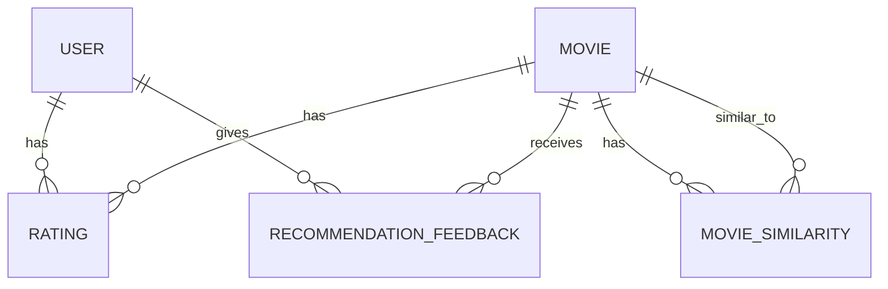

# 4. 数据库设计

## 4.1 数据库表结构

系统使用MySQL数据库，设计了以下核心表：

### 4.1.1 users表

| 字段名 | 数据类型 | 约束 | 描述 |
| :--- | :--- | :--- | :--- |
| `id` | `INT` | `PRIMARY KEY, AUTO_INCREMENT` | 用户ID |
| `username` | `VARCHAR(64)` | `UNIQUE, NOT NULL, INDEX` | 用户名 |
| `password_hash` | `VARCHAR(256)` | `NOT NULL` | 密码哈希值 |
| `created_at` | `DATETIME` | `NOT NULL, DEFAULT CURRENT_TIMESTAMP` | 创建时间 |

### 4.1.2 movies表

| 字段名 | 数据类型 | 约束 | 描述 |
| :--- | :--- | :--- | :--- |
| `id` | `INT` | `PRIMARY KEY, AUTO_INCREMENT` | 电影ID |
| `title` | `VARCHAR(255)` | `NOT NULL, INDEX` | 电影标题 |
| `year` | `INT` | `NULL, INDEX` | 电影年份 |
| `genres` | `VARCHAR(255)` | `NULL` | 电影类型，多个类型用竖线分隔 |

### 4.1.3 ratings表

| 字段名 | 数据类型 | 约束 | 描述 |
| :--- | :--- | :--- | :--- |
| `id` | `INT` | `PRIMARY KEY, AUTO_INCREMENT` | 评分ID |
| `user_id` | `INT` | `NOT NULL, INDEX, FOREIGN KEY` | 用户ID，关联users表 |
| `movie_id` | `INT` | `NOT NULL, INDEX, FOREIGN KEY` | 电影ID，关联movies表 |
| `rating` | `FLOAT` | `NOT NULL` | 评分值（0.5-5.0） |
| `timestamp` | `DATETIME` | `NULL` | 评分时间 |
| `UNIQUE KEY` | - | `(user_id, movie_id)` | 确保用户对同一电影只有一条评分记录 |

### 4.1.4 movie_similarity表

| 字段名 | 数据类型 | 约束 | 描述 |
| :--- | :--- | :--- | :--- |
| `id` | `INT` | `PRIMARY KEY, AUTO_INCREMENT` | 相似度记录ID |
| `movie_id` | `INT` | `NOT NULL, INDEX, FOREIGN KEY` | 电影ID，关联movies表 |
| `similar_movie_id` | `INT` | `NOT NULL, INDEX, FOREIGN KEY` | 相似电影ID，关联movies表 |
| `score` | `FLOAT` | `NOT NULL` | 相似度分数 |
| `UNIQUE KEY` | - | `(movie_id, similar_movie_id)` | 确保每对电影只有一条相似度记录 |

### 4.1.5 recommendation_feedback表

| 字段名 | 数据类型 | 约束 | 描述 |
| :--- | :--- | :--- | :--- |
| `id` | `INT` | `PRIMARY KEY, AUTO_INCREMENT` | 反馈ID |
| `user_id` | `INT` | `NOT NULL, INDEX, FOREIGN KEY` | 用户ID，关联users表 |
| `movie_id` | `INT` | `NOT NULL, INDEX, FOREIGN KEY` | 电影ID，关联movies表 |
| `feedback` | `VARCHAR(16)` | `NOT NULL` | 反馈类型（like/dislike） |
| `context` | `VARCHAR(64)` | `NOT NULL, DEFAULT ''` | 反馈上下文 |
| `created_at` | `DATETIME` | `NOT NULL, DEFAULT CURRENT_TIMESTAMP, INDEX` | 创建时间 |
| `UNIQUE KEY` | - | `(user_id, movie_id, context)` | 确保用户在同一上下文中对同一电影只有一条反馈记录 |

## 4.2 数据库关系设计

数据库表之间的关系如图4-1所示：

图4-1 数据库表关系图

## 4.3 索引设计

为了提高查询性能，系统在以下字段上创建了索引：

- **users表**：`username`字段创建了唯一索引，加速用户登录和注册时的查询。
- **movies表**：`title`字段创建了普通索引，加速电影搜索；`year`字段创建了普通索引，加速按年份查询。
- **ratings表**：`user_id`和`movie_id`字段分别创建了普通索引，加速按用户和电影查询评分；同时创建了`(user_id, movie_id)`的唯一索引，确保数据完整性。
- **movie_similarity表**：`movie_id`和`similar_movie_id`字段分别创建了普通索引，加速相似电影的查询；同时创建了`(movie_id, similar_movie_id)`的唯一索引，确保数据完整性。
- **recommendation_feedback表**：`user_id`、`movie_id`和`created_at`字段分别创建了普通索引，加速反馈查询；同时创建了`(user_id, movie_id, context)`的唯一索引，确保数据完整性。

## 4.4 数据导入设计

系统使用`import_movielens.py`脚本从MovieLens数据集中导入数据。导入流程如下：

1. 读取MovieLens数据集中的movies.csv和ratings.csv文件
2. 解析movies.csv文件，提取电影ID、标题、年份和类型信息
3. 解析ratings.csv文件，提取用户ID、电影ID、评分值和评分时间信息
4. 将解析后的数据插入到相应的数据库表中

数据导入脚本支持不同规模的MovieLens数据集，包括ml-latest-small和ml-32m等。