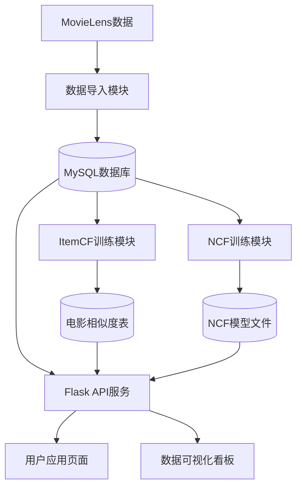

# 3. 系统架构设计

## 3.1 整体架构

系统采用分层架构设计，包括数据层、服务层和表示层三个主要层次。数据层负责数据的存储和管理，服务层负责业务逻辑的处理，表示层负责用户界面的展示。系统的整体架构如图3-1所示。

图3-1 系统整体架构图

## 3.2 模块划分

系统按照功能和职责划分为以下几个核心模块：

### 3.2.1 数据导入模块
- **功能**：负责将MovieLens数据集导入到MySQL数据库中。
- **实现文件**：`backend/scripts/import_movielens.py`
- **流程**：读取MovieLens数据文件，解析数据，创建数据库表，并将数据插入到相应的表中。

### 3.2.2 模型训练模块
- **ItemCF训练**：负责训练基于物品的协同过滤模型，计算电影之间的相似度。
  - 实现文件：`backend/scripts/train_itemcf.py`
  - 流程：从数据库中读取评分数据，构建电影-用户评分矩阵，计算电影之间的余弦相似度，将相似度结果存储到数据库中。

- **NCF训练**：负责训练神经协同过滤模型。
  - 实现文件：`backend/scripts/train_ncf.py`
  - 流程：从数据库中读取评分数据，构建训练数据集，训练NCF模型，将模型和相关元数据保存到文件系统中。

### 3.2.3 模型评估模块
- **ItemCF评估**：负责评估ItemCF算法的性能。
  - 实现文件：`backend/scripts/evaluate_itemcf.py`
  - 流程：从数据库中读取评分数据，划分训练集和测试集，使用ItemCF算法进行推荐，计算评估指标。

- **多模型评估**：负责评估多种推荐算法的性能，并进行消融实验。
  - 实现文件：`backend/scripts/evaluate_models.py`
  - 流程：从数据库中读取评分数据，划分训练集和测试集，使用不同的推荐算法进行推荐，计算评估指标，比较不同算法的性能。

### 3.2.4 Web API服务模块
- **功能**：提供RESTful API接口，处理用户请求，返回相应的结果。
- **实现文件**：`backend/app/routes.py`
- **主要接口**：
  - 用户认证接口：注册、登录、退出
  - 电影接口：电影列表、电影详情、热门电影
  - 评分接口：提交评分、查看评分历史
  - 推荐接口：个性化推荐、推荐解释
  - 统计接口：评分分布、类型分布、年份趋势等

### 3.2.5 数据可视化模块
- **功能**：展示系统的统计数据和评估结果。
- **实现文件**：`backend/app/templates/dashboard.html`
- **技术栈**：Bootstrap + ECharts
- **主要图表**：评分分布柱状图、类型分布饼图、年份趋势折线图、用户活跃度柱状图等。

## 3.3 数据流设计

系统的数据流设计如下：

1. **数据导入流程**：
   - 从MovieLens数据集读取电影和评分数据
   - 将数据插入到MySQL数据库的movies和ratings表中

2. **模型训练流程**：
   - 从数据库中读取评分数据
   - 训练ItemCF模型，计算电影相似度，存储到movie_similarity表中
   - 训练NCF模型，保存模型文件到artifacts目录

3. **推荐流程**：
   - 用户登录系统
   - 用户请求推荐
   - 系统根据用户选择的推荐算法（ItemCF、NCF或Hybrid）生成推荐结果
   - 系统返回推荐结果和推荐解释

4. **评分流程**：
   - 用户对电影进行评分
   - 系统将评分存储到ratings表中
   - 系统更新用户的评分历史

5. **反馈流程**：
   - 用户对推荐结果进行反馈（喜欢/不喜欢）
   - 系统将反馈存储到recommendation_feedback表中

6. **数据可视化流程**：
   - 用户访问dashboard页面
   - 系统从数据库中查询统计数据
   - 系统将数据转换为图表展示

## 3.4 技术栈选择

系统采用以下技术栈：

- **后端**：Python 3.10、Flask、Flask-Login、Flask-SQLAlchemy
- **数据库**：MySQL、PyMySQL
- **机器学习**：NumPy、Pandas、SciPy、scikit-learn、PyTorch
- **前端**：HTML、CSS、JavaScript、Bootstrap、ECharts
- **开发工具**：VS Code、Git

技术栈选择的理由：

- **Flask**：轻量级Web框架，易于学习和使用，适合构建RESTful API。
- **MySQL**：成熟稳定的关系型数据库，适合存储结构化数据。
- **PyTorch**：强大的深度学习框架，适合实现NCF模型。
- **Bootstrap**：响应式前端框架，易于构建美观的用户界面。
- **ECharts**：功能强大的可视化库，适合展示各种统计数据。